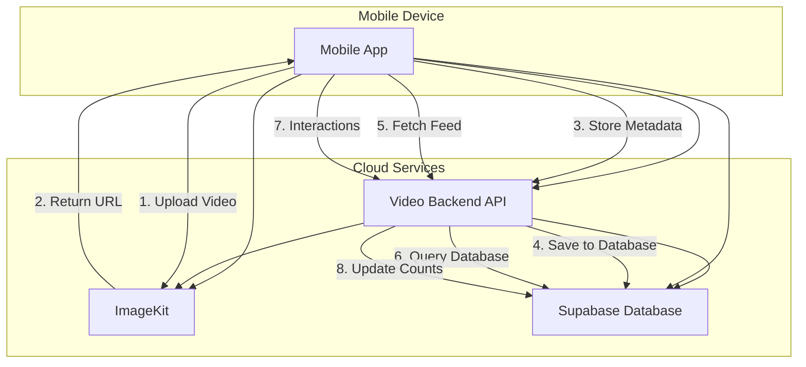

```mermaid
graph TD
    A[Mobile App] --> B[ImageKit]
    A --> C[Video Backend API]
    C --> D[Supabase Database]
    C --> B
    A --> D

    subgraph Mobile Device
        A
    end

    subgraph Cloud Services
        B
        C
        D
    end

    A -->|1. Upload Video| B
    B -->|2. Return URL| A
    A -->|3. Store Metadata| C
    C -->|4. Save to Database| D
    A -->|5. Fetch Feed| C
    C -->|6. Query Database| D
    A -->|7. Interactions| C
    C -->|8. Update Counts| D
```
